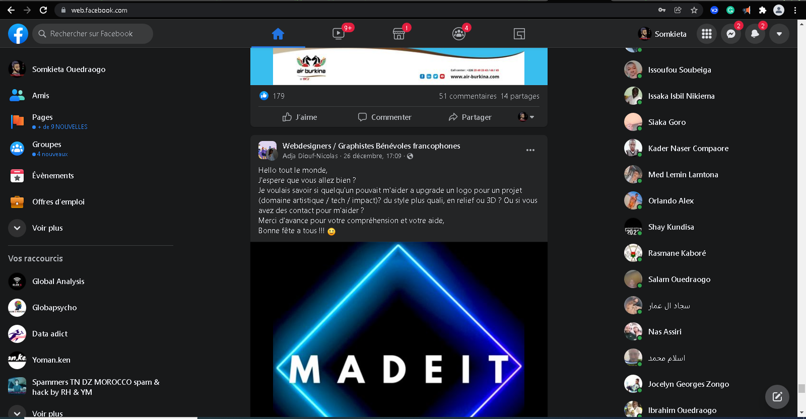
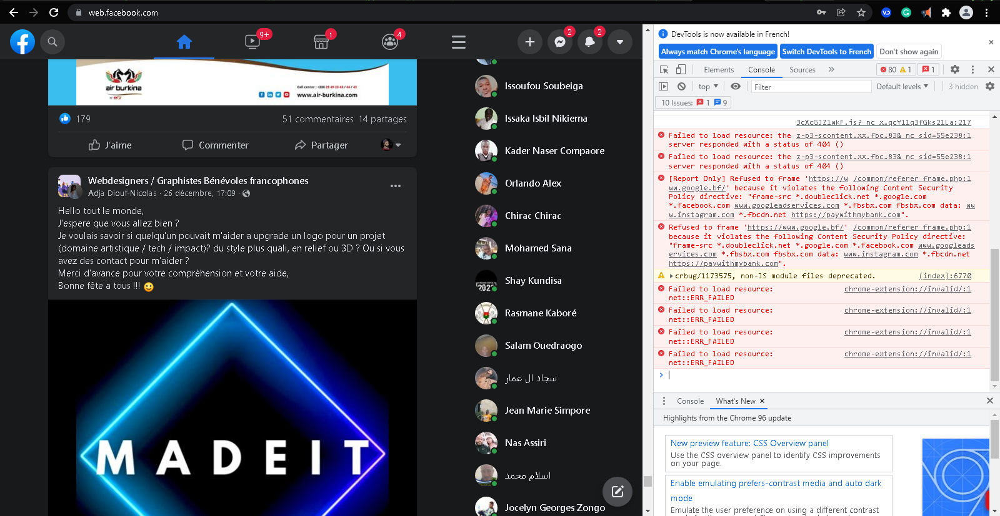
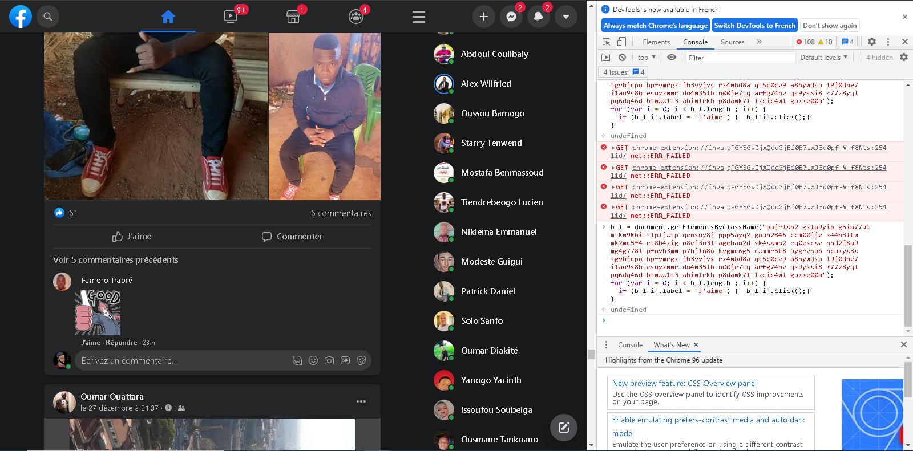

# Hit-Like-Button
Social networking can help a business gain contacts, clients, and increased public awareness.  Even entrepreneurs who run small businesses from their homes can take advantage of this resource to set up a global presence. The best way to get more people interested to view your profile and send you a friend request is to hit the like button that why i build this simple javascrit code to help you achieve this task.

## How to use this script ?

   At first step download the script and store it on your computer.
   Then open the like_all.js file with your favorite text editor and go to your facebook landing page.
    > 
   Scroll down to include most post than you can then right click and choose inspect element. And go to console.
   > 
   Copy and past the like_all.js and press press enter.
   > 
  You sucess fully like all those post.
 
## Buy Me A Coffe
Perfect Money : U289663800
BTC : bc1qxm4e7fr0w9vv73qn4lmnxp4u5ekgndxx33trhk

## Contact info :
email : prof.alex.wolf@gmail.com 
whatsapp : https://wa.me/+22672587871
   
